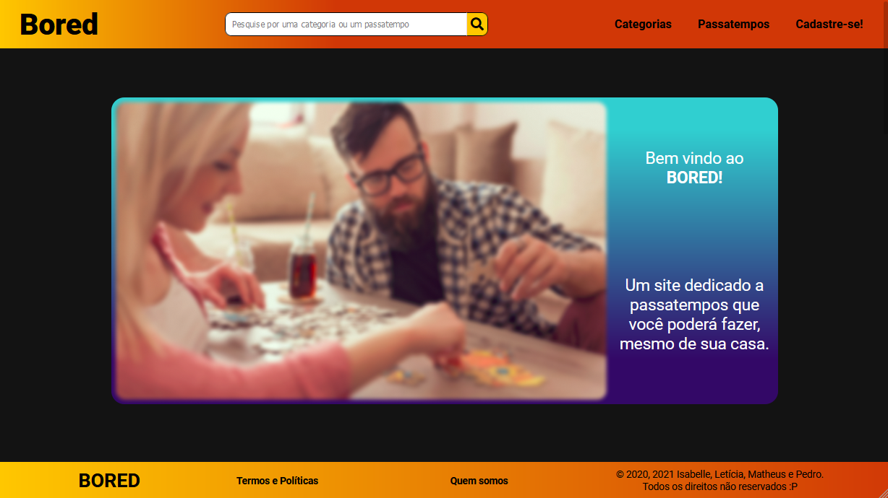
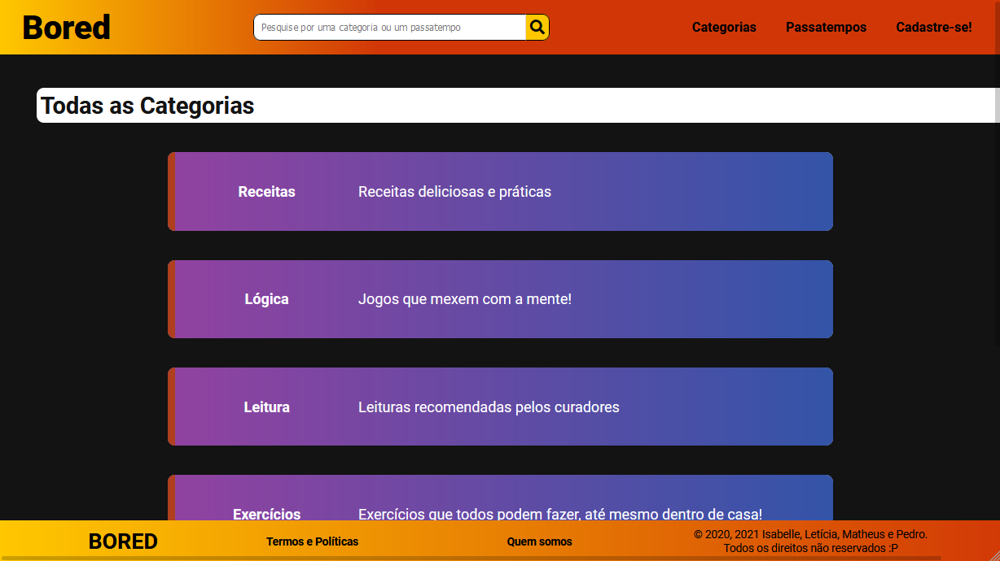
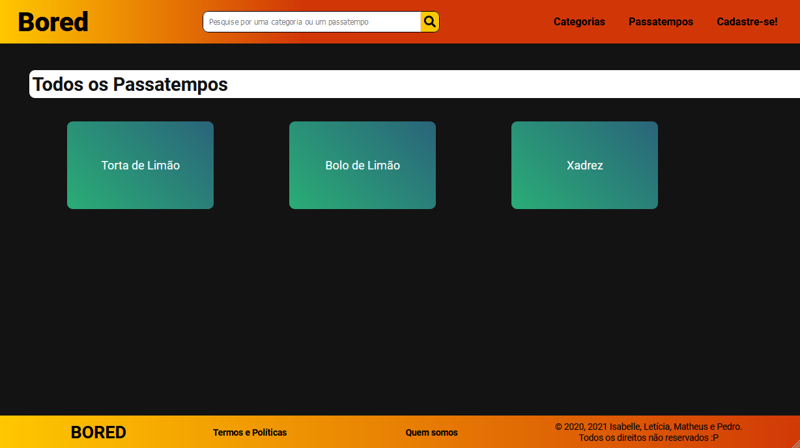

# BORED

## Olá 👋

Bem vindo ao repositório do site BORED.

## Sobre o projeto 💻
O BORED é um projeto feito em _PHP_, _HTML_ e _CSS puro_. Foi desenvolvido para a disciplina **Desenvolvimento de Sistemas Web**, ministrada pelo prof. @Trojahn, no [Instituto Federal de São Paulo](https://scl.ifsp.edu.br/).
Esse projeto foi feito por mim e meus outros três amigos. Quisemos fazer uma interface bonita e bem atual.

## Premissa 💡
O BORED é um site de _passatempos_ para serem feitos em casa, uma vez que, desde o ano passado (2020), estamos em uma pandemia.
No site é possível ver categorias a que um passatempo pertence, comentar em um passatempo (isso feito mediante login).
Caso o usuário que entre no sistema seja um admin, poderá também cadastrar ou atualizar um passatempo e liberar ou barrar um comentário.

### Algumas imagens do site 👀
#### Página inical:

#### Página de categorias para agrupar e tematizar os passatempos:

#### Página dos passatempos (da primeira catgoria -> _Receitas_):

## Agradecimentos 😃

Agradecemos ao prof. @Trojahn que nos ensinou todos os conceitos da linguagem PHP e pelo tempo disponibilizado para ajuda nos demais erros e desafios que enfrentamos ao longo dessa jornada.

#### E muito obrigado a você por ter dado uma olhadinha aqui! (っ˘ω˘ς)
